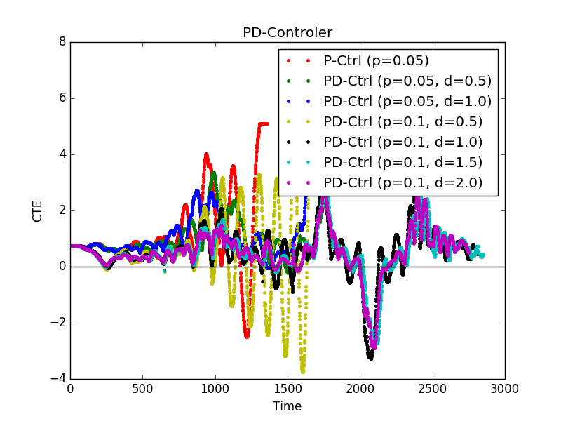
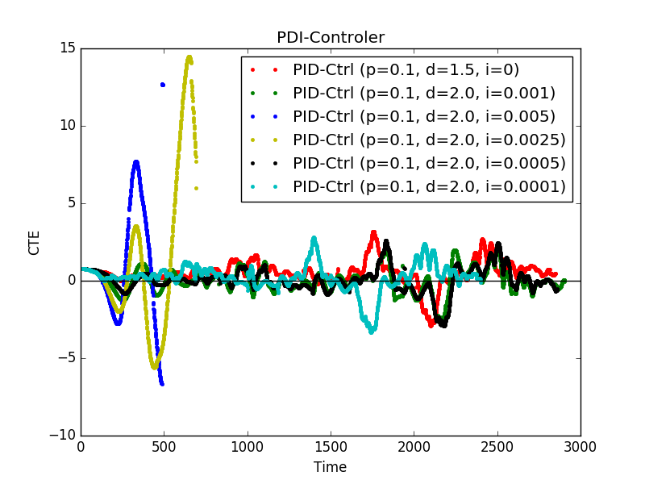

# How the final hyperparameters were chosen.

The best hyperparameters for this project I have found are **0.1 (P), 1.5 (D) and 0.0005 (I)**.

I found these parameters through manual tuning.

In detail, I started with all parameters set to zero. Then my goal was to iteratively change P and D parameters until I see as little as possible oscillations. (so, increase P and then play with D. then go back change P and D, etc.).

In the scatter plot with title "PD Controller" one can see that the combo P=0.1 and D=1.5 (cyan color) does a pretty ok job.
(x-axis for the graph denotes discrete time steps. and y-axis represents the CTE)
I stopped with these parameters since the car was able to finish the track without overshooting too much.

Then I started changing the "I gain" until I could not improve the  performance anymore. Taking the best P, D values from above I could see that "I values" above 0.001 do not yield good performance. As the below graph shows setting "I" to 0.0005 (black scatter plot) gave best results.

# Effect of the P, I, D component on the PID algorithm

- **the P component** controls how strong in proportion to the CTE we control the steering of our vehicle.
An interesting aspect is shown in the first graph with the first (red) scatter plot: setting only the P component and D=I=0 will make the error oscillate until we overshoot too much and leave the track.

- **The D component** does a good job stopping strong oscillations by making the steering dependent also on the temporal derivative of the CTE. If the error becomes smaller and smaller the D component has an effect of counter steering to avoid overshooting.
In our experiments a coefficient of 1.5 (+/- 0.5) did a good job damping oscillations and the car could already finish the track on its own.

- Adding an "**I term**" makes the steering proportional to the sum of all CTEs. This helps to adjust to a bias our vehicle might have in regard to steering.
Looking at the second graph one can see that setting the integral coefficient to a value like 0.0005 (black plot) yields better results than leaving the value 0 (red plot).
